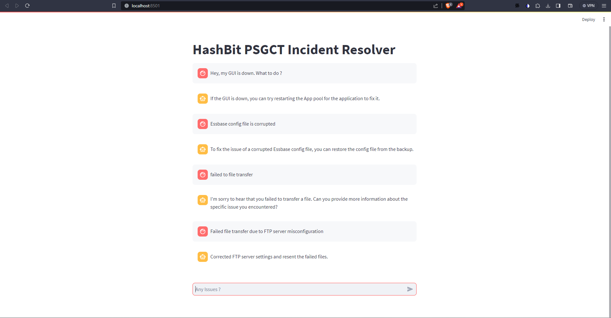

# HashBit PSGCT - Incident Resolver

The main goal of this project is to create a strong and flexible platform that can automatically handle and solve incidents using AI methods. By looking at past data and patterns, participants will build a system that can find solutions for specific incidents. Additionally, the system will also automatically put these solutions into action, considering how often incidents happen and how successful the solutions have been historically.

### What is needed ?

- To create an extensive incident-resolution database that covers a diverse range of incidents and their respective resolutions.
- To develop a sophisticated platform that integrates the capabilities of artificial intelligence.
- Implement a solution to incorporate self-healing mechanism that leverage historical data.
- A UI which facilitate user interaction, allowing users to report incidents and observe resolution outcomes.

### What we have done :

- Expanded the Dataset with datapoints
- Preprocessing of the Dataset
- GUI created with Streamlit
- ChatGPT, a LLM AI framework has been intergrated to search among the context
- Log4j for logging events

### Internal Workflow

The underlying operational mechanism of the project entails a sequence of intricately linked stages that seamlessly maneuver through user inputs, historical data analysis, and resolution presentation within the Streamlit GUI. Here's a comprehensive breakdown of the internal workflow:

1. **User Query Integration via Streamlit GUI:**

   - The Streamlit graphical user interface (GUI) serves as the ingress point for users to input their queries or prompts concerning specific incidents or issues necessitating resolutions.
   - User interaction is channeled through this interface by entering queries into the designated input field, thereby initiating the systematic resolution-seeking process.

2. **Query Processing and Langchain Incorporation:**

   - The user-provided query undergoes processing via integration with the Langchain module.
   - Langchain serves as a sophisticated language-processing component responsible for deciphering, parsing, and extracting essential contextual elements from the user's query. This entails converting natural language inputs into computationally accessible data structures for further analysis.

3. **Historical Data Analytics via Langchain Integration:**

   - Langchain interfaces with the repository housing historical data, employing its advanced natural language processing (NLP) capabilities for in-depth analysis.
   - The historical data repository houses a corpus of past incidents, accompanied by their respective queries and associated resolutions.
   - Langchain's NLP prowess enables the identification of intricate patterns, correlations, and potential resolutions entwined within the historical dataset.

4. **Resolution Rendering:**

   - Relying on the outcomes of historical data analysis, Langchain ascertains the most suitable resolution aligned with the user's query.
   - The system proceeds to manifest this identified resolution within the Streamlit GUI interface.
   - Users are then presented with a curated resolution, furnishing them with actionable directives to effectively address the specific incident at hand.

5. **Augmenting Historical Data Repositories:**
   - Following the presentation of the resolution, the system captures both the original user query and the ensuing resolution.
   - This newly minted set of data points is seamlessly incorporated into the existing historical data repository, bolstering its repository with each successive interaction.
   - This perpetual expansion fortifies the system's adeptness in rendering precise and efficacious resolutions over time, nurturing an evolving repository tailored to user interactions.

Through this intricate technical dance, the system ingeniously fuses user input and historical data analytics, ultimately culminating in the delivery of insightful resolutions to diverse incidents. This amalgamation of natural language processing, historical data mining, and dynamic user engagement facilitates a dynamic ecosystem that continually heightens its resolution acumen across successive interactions.

### Limitation of the system :

- Open AI provides a free API which has cap limit of 3 queries per minute (minimum 20 seconds between successive queries)

### Running of System

- Install the dependencies using `pip install -r requirements.txt`
- Run the UI using `streamlit run Web.py`
- Create `.env` file and add the content `OPENAI_API_KEY=<OPENAI API KEY>`

### OPEN AI API KEY rules:

- As of now API key is available in ```key.txt```. if key is expired, go to  to get a free key

### Expected output



